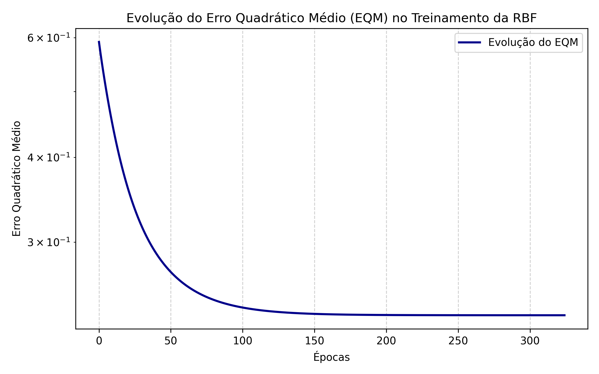
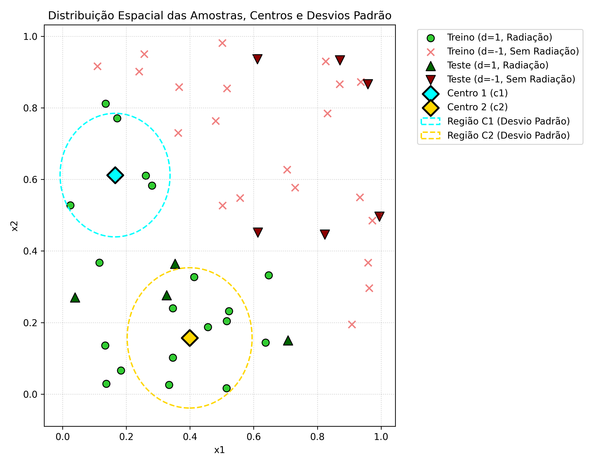

# Resolução da Atividade 1 - Rede de Função de Base Radial (RBF)

**Instituição:** Centro Federal de Educação Tecnológica de Minas Gerais (CEFET-MG)  
**Campus:** VIII – Varginha  
**Curso:** Bacharelado em Sistemas de Informação  
**Disciplina:** Laboratório de Inteligência Artificial  
**Professor:** Lázaro Eduardo da Silva  
**Trabalho:** Resolução da Atividade RBF 1  

---

## 1. Introdução e Topologia da Rede

A detecção de radiação em compostos nucleares é modelada a partir de duas variáveis de entrada ($x_1$ e $x_2$), que representam concentrações químicas. O objetivo é treinar uma rede de Função de Base Radial (RBF) com **2 entradas**, **2 neurônios na camada escondida** ($K=2$) e **1 saída linear** com pós-processamento de classificação. 

A padronização das classes é:
- **Saída desejada ($d = 1$):** Presença de radiação (19 amostras no treino).
- **Saída desejada ($d = -1$):** Ausência de radiação (21 amostras no treino).

---

## 2. Treinamento da Camada Escondida (K-Means)

Conforme a especificação acadêmica, os centros dos dois agrupamentos ($K=2$) foram calculados considerando **apenas as amostras de treinamento que possuem radiação ($d = 1$)**.
O algoritmo K-Means foi inicializado utilizando os dois primeiros padrões com $d=1$ da tabela:
- $c_1^{(0)} = [0.1157, 0.3676]$
- $c_2^{(0)} = [0.5147, 0.0167]$

Após **4 iterações**, o algoritmo convergiu. A variância ($\sigma^2$) de cada cluster foi calculada por duas abordagens:
1. **Populacional (Denominador $N$):** $\sigma^2 = \frac{1}{N_j} \sum_{x \in C_j} \|x - c_j\|^2$
2. **Amostral (Denominador $N-1$):** $\sigma^2 = \frac{1}{N_j-1} \sum_{x \in C_j} \|x - c_j\|^2$

### Parâmetros Obtidos para a Camada Oculta:

| Cluster | Centro ($c_j$) | Variância Populacional ($\sigma^2_N$) | Variância Amostral ($\sigma^2_{N-1}$) | Tamanho do Cluster |
| :---: | :---: | :---: | :---: | :---: |
| **1** | $[0.164833, 0.612117]$ | **0.029806** | 0.035767 | 6 amostras |
| **2** | $[0.398969, 0.157131]$ | **0.038460** | 0.041665 | 13 amostras |

> [!NOTE]
> Para o treinamento subsequente da camada de saída, utilizou-se a **variância populacional ($\sigma^2_N$)** e a formulação gaussiana padrão da função de base radial com o fator $2$ no denominador da exponencial:
> $$g_j(x) = \exp\left( - \frac{\|x - c_j\|^2}{2 \sigma_j^2} \right)$$

---

## 3. Treinamento da Camada de Saída

O treinamento do neurônio de saída linear foi executado com a **Regra Delta Generalizada**, utilizando:
- **Taxa de aprendizado ($\eta$):** $0.01$
- **Precisão de parada ($\epsilon$):** $10^{-7}$
- **Entrada de viés (Bias):** $x_0 = -1.0$
- **Pesos iniciais:** Gerados aleatoriamente entre $0$ e $1$ ($W_{21,0} = 0.3745$, $W_{21,1} = 0.9507$, $W_{21,2} = 0.7320$).

O treinamento levou **325 épocas** para atingir o critério de parada ($\Delta EQM < 10^{-7}$). 

### Vetor de Pesos Finais:

| Peso | Descrição | Valor |
| :---: | :---: | :---: |
| **$W_{21,0}$** | Peso do Bias ($x_0 = -1.0$) | **1.002658** |
| **$W_{21,1}$** | Peso do neurônio oculto 1 ($g_1$) | **2.378063** |
| **$W_{21,2}$** | Peso do neurônio oculto 2 ($g_2$) | **2.697715** |

A equação da saída da rede antes do pós-processamento é dada por:
$$y(x) = 2.378063 \cdot g_1(x) + 2.697715 \cdot g_2(x) - 1.002658$$

---

## 4. Validação da Rede (Conjunto de Teste)

Dado que o problema é de classificação binária, as saídas reais contínuas foram submetidas ao pós-processamento utilizando a **função sinal**:
$$y_{pós} = \text{sinal}(y) = \begin{cases} 1, & y \geq 0 \\ -1, & y < 0 \end{cases}$$

A tabela abaixo descreve o desempenho nas 10 amostras do conjunto de teste:

| Amostra | $x_1$ | $x_2$ | Desejado ($d$) | Saída Rede ($y$) | Saída Pós-Processada ($y_{pós}$) | Classificação |
| :---: | :---: | :---: | :---: | :---: | :---: | :---: |
| **1** | 0.8705 | 0.9329 | -1 | -1.002498 | -1 | **Correto** |
| **2** | 0.0388 | 0.2703 | 1 | -0.323121 | -1 | **Incorreto** |
| **3** | 0.8236 | 0.4458 | -1 | -0.914037 | -1 | **Correto** |
| **4** | 0.7075 | 0.1502 | 1 | -0.220073 | -1 | **Incorreto** |
| **5** | 0.9587 | 0.8663 | -1 | -1.002571 | -1 | **Correto** |
| **6** | 0.6115 | 0.9365 | -1 | -0.987776 | -1 | **Correto** |
| **7** | 0.3534 | 0.3646 | 1 | 0.966503 | 1 | **Correto** |
| **8** | 0.3268 | 0.2766 | 1 | 1.323192 | 1 | **Correto** |
| **9** | 0.6129 | 0.4518 | -1 | -0.468184 | -1 | **Correto** |
| **10** | 0.9948 | 0.4962 | -1 | -0.996650 | -1 | **Correto** |

### Métricas Finais de Desempenho:
- **Taxa de Acerto no Treinamento:** **92.50%** (37/40 padrões corretos)
- **Taxa de Acerto no Teste (Validação):** **80.00%** (8/10 padrões corretos)

---

## 5. Análise Gráfica

### A. Curva de Aprendizado (Convergência do EQM)
O gráfico abaixo apresenta a evolução do Erro Quadrático Médio (EQM) no decorrer das épocas de treinamento na camada de saída. O erro diminui de maneira suave e contínua devido à natureza linear e convexa da camada de saída.

### B. Distribuição Espacial e Agrupamentos
O mapa de dispersão espacial ilustra a localização das amostras de treinamento e teste. Os centros dos clusters obtidos pelo K-means estão destacados, e os círculos tracejados representam as regiões equivalentes a um desvio padrão ($\sigma$) ao redor de cada centro.

*Análise Visual:* Os padrões com presença de radiação ($d = 1$) estão situados na região inferior-esquerda e central-esquerda. As amostras de teste 2 e 4 encontram-se em áreas periféricas fora das esferas de alta influência dos dois neurônios de base radial, explicando por que foram incorretamente classificadas com $-1$ (a saída foi dominada pelo termo de bias negativo).

---

## 6. Estratégias para Aumento da Taxa de Acerto

Para mitigar os erros de generalização no conjunto de teste e elevar a taxa de acerto acima de 80.00%, as seguintes estratégias acadêmicas podem ser adotadas:

1. **Aumento do número de neurônios ocultos ($K > 2$):**  
   Com apenas dois neurônios RBF ($K=2$), a rede possui um poder de representação muito restrito. Ao utilizarmos $K=3$ ou $K=4$, criamos novas partições gaussianas no espaço de estados, permitindo mapear melhor regiões periféricas (como a das amostras de teste 2 e 4).

2. **Agrupamento (Clustering) Global com Amostras de Ambas as Classes:**  
   Em vez de executar o K-Means apenas sobre amostras da classe positiva ($d=1$), pode-se executar o K-Means sobre **todo** o conjunto de treinamento (com $K=4$ ou superior, por exemplo). Dessa forma, a camada intermediária aprende representações gaussianas que delimitam tanto a distribuição de radiação quanto a distribuição de sua ausência, melhorando as fronteiras de decisão da camada de saída.

3. **Otimização da Variância ($\sigma^2$):**  
   O desvio padrão foi determinado unicamente a partir da dispersão intrínseca dos clusters. Podemos experimentar outras formulações para a largura ($\sigma$), como a fórmula baseada na distância máxima entre os centros:
   $$\sigma = \frac{d_{max}}{\sqrt{2K}}$$
   Alargar ou estreitar as gaussianas controla a capacidade de suavização e a taxa de decaimento da ativação, permitindo que amostras distantes ainda recebam influência significativa das funções radiais.

4. **Normalização dos Dados de Entrada:**  
   Colocar os dados em escalas perfeitamente idênticas (por exemplo, normalização min-max ou escore-Z) evita distorções na métrica de distância euclidiana, garantindo um comportamento isotrópico para as funções Gaussianas e uma convergência ideal para o K-Means.
