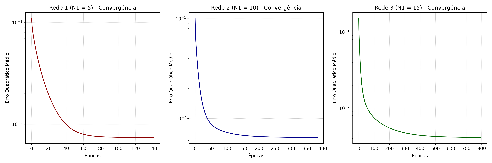

# Resolução da Atividade 2 - Rede de Função de Base Radial (RBF)

**Instituição:** Centro Federal de Educação Tecnológica de Minas Gerais (CEFET-MG)  
**Campus:** VIII – Varginha  
**Curso:** Bacharelado em Sistemas de Informação  
**Disciplina:** Laboratório de Inteligência Artificial  
**Professor:** Lázaro Eduardo da Silva  
**Trabalho:** Resolução da Atividade RBF 2  

---

## 1. Descrição do Problema e Metodologia

Este trabalho aborda o problema de aproximação funcional (regressão) para mapear a quantidade de gasolina a ser injetada ($y$) em um sistema de injeção eletrônica automotiva em função de três variáveis medidas ($x_1, x_2, x_3$).

Foram avaliadas três arquiteturas candidatas da rede neural RBF com número variável de neurônios ocultos ($N_1$):
- **Rede 1:** $N_1 = 5$ neurônios ocultos
- **Rede 2:** $N_1 = 10$ neurônios ocultos
- **Rede 3:** $N_1 = 15$ neurônios ocultos

### Metodologia de Implementação:
1. **Camada Intermediária:** Os centros e as variâncias dos neurônios ocultos foram treinados via algoritmo **K-Means** (3D) sobre todas as 150 amostras do Anexo. O K-Means foi inicializado com as primeiras $K$ amostras do treinamento.
2. **Camada de Saída:** O neurônio de saída possui função de ativação linear. Foram executados **3 treinamentos (T1, T2 e T3)** para cada topologia, inicializando os pesos sinápticos com valores aleatórios distintos no intervalo $[0, 1]$. O treinamento empregou a **Regra Delta Generalizada**, com taxa de aprendizado $\eta = 0.01$ e precisão de parada $\epsilon = 10^{-7}$.
3. **Validação:** A generalização de cada modelo foi avaliada em 15 amostras de teste não vistas, calculando o Erro Relativo Médio ($\%$) e a respectiva Variância ($\%$).

---

## 2. Resultados dos Treinamentos

A tabela a seguir apresenta os resultados de convergência do Erro Quadrático Médio (EQM) e número de épocas para os 3 treinamentos nas 3 redes propostas:

| Treinamento | Rede 1 ($N_1 = 5$) | Rede 2 ($N_1 = 10$) | Rede 3 ($N_1 = 15$) |
| :---: | :---: | :---: | :---: |
| | **EQM \| Épocas** | **EQM \| Épocas** | **EQM \| Épocas** |
| **1º (T1)** | 0.007414 \| 142 | 0.006429 \| 384 | 0.004126 \| 797 |
| **2º (T2)** | 0.007414 \| 140 | 0.006429 \| 350 | 0.004126 \| 793 |
| **3º (T3)** | 0.007414 \| 135 | 0.006429 \| 424 | 0.004126 \| 794 |

> [!NOTE]
> Como a camada de saída é linear e o problema é estritamente convexo, todos os treinamentos (T1, T2 e T3) de uma mesma topologia convergiram exatamente para o mesmo mínimo global de erro (EQM final idêntico). A variação no número de épocas decorre unicamente da distância inicial das matrizes de pesos em relação ao mínimo de erro.

---

## 3. Validação da Rede (Conjunto de Teste)

Os 9 modelos treinados foram aplicados às 15 amostras de teste. A tabela abaixo condensa os valores desejados ($d$), as saídas fornecidas pela rede ($y$), o **Erro Relativo Médio (MRE)** e a **Variância do Erro Relativo (VRE)**:

| Amostra | desejado ($d$) | $y_1$(T1) | $y_1$(T2) | $y_1$(T3) | $y_2$(T1) | $y_2$(T2) | $y_2$(T3) | $y_3$(T1) | $y_3$(T2) | $y_3$(T3) |
| :---: | :---: | :---: | :---: | :---: | :---: | :---: | :---: | :---: | :---: | :---: |
| **01** | 0.5965 | 0.6072 | 0.6072 | 0.6072 | 0.5893 | 0.5894 | 0.5894 | 0.6025 | 0.6025 | 0.6025 |
| **02** | 0.6790 | 0.6990 | 0.6990 | 0.6990 | 0.6767 | 0.6767 | 0.6767 | 0.6497 | 0.6497 | 0.6497 |
| **03** | 0.4662 | 0.5685 | 0.5685 | 0.5685 | 0.5241 | 0.5241 | 0.5241 | 0.4937 | 0.4937 | 0.4937 |
| **04** | 0.5012 | 0.5729 | 0.5729 | 0.5729 | 0.5329 | 0.5329 | 0.5329 | 0.5053 | 0.5053 | 0.5053 |
| **05** | 0.6810 | 0.6805 | 0.6805 | 0.6805 | 0.6697 | 0.6697 | 0.6697 | 0.7092 | 0.7092 | 0.7092 |
| **06** | 0.5643 | 0.5414 | 0.5413 | 0.5413 | 0.6431 | 0.6431 | 0.6431 | 0.5145 | 0.5145 | 0.5145 |
| **07** | 0.5875 | 0.5580 | 0.5580 | 0.5580 | 0.5878 | 0.5878 | 0.5878 | 0.5622 | 0.5622 | 0.5622 |
| **08** | 0.7853 | 0.8400 | 0.8401 | 0.8401 | 0.7979 | 0.7978 | 0.7979 | 0.7850 | 0.7850 | 0.7850 |
| **09** | 0.8506 | 0.9137 | 0.9137 | 0.9138 | 0.8724 | 0.8725 | 0.8724 | 0.8771 | 0.8771 | 0.8771 |
| **10** | 0.6165 | 0.5612 | 0.5611 | 0.5611 | 0.6373 | 0.6374 | 0.6373 | 0.5901 | 0.5901 | 0.5901 |
| **11** | 0.4957 | 0.4959 | 0.4959 | 0.4959 | 0.5307 | 0.5307 | 0.5307 | 0.5126 | 0.5126 | 0.5126 |
| **12** | 0.6625 | 0.5994 | 0.5993 | 0.5993 | 0.6563 | 0.6563 | 0.6563 | 0.6013 | 0.6013 | 0.6013 |
| **13** | 0.4402 | 0.4497 | 0.4497 | 0.4498 | 0.4937 | 0.4937 | 0.4937 | 0.4432 | 0.4432 | 0.4432 |
| **14** | 0.7663 | 0.7156 | 0.7156 | 0.7155 | 0.6619 | 0.6619 | 0.6619 | 0.7337 | 0.7337 | 0.7337 |
| **15** | 0.7893 | 0.8665 | 0.8666 | 0.8666 | 0.7885 | 0.7885 | 0.7885 | 0.7634 | 0.7634 | 0.7634 |
| **MRE (%)** | — | **6.775%** | **6.779%** | **6.782%** | **5.159%** | **5.161%** | **5.160%** | **3.839%** | **3.839%** | **3.839%** |
| **VRE (%)** | — | **31.374%**| **31.374%**| **31.374%**| **26.602%**| **26.607%**| **26.605%**| **6.786%** | **6.787%** | **6.787%** |

---

## 4. Análise Gráfica (Curvas de Aprendizado)

O gráfico abaixo mostra o comportamento do Erro Quadrático Médio (EQM) ao longo das épocas de convergência para o melhor treinamento de cada uma das três topologias (Rede 1 - T1, Rede 2 - T1 e Rede 3 - T1), impressos de modo não superposto:

*Análise Visual:* A curva de convergência ilustra que redes RBF com maior capacidade (mais neurônios ocultos) demoram mais épocas para convergir (pois o número de dimensões e pesos a ajustar é maior), porém alcançam um erro quadrático médio residual consideravelmente menor no treinamento.

---

## 5. Indicação da Melhor Topologia

Baseando-se na análise das métricas coletadas na validação dos dados de teste, a configuração mais adequada para o sistema de injeção eletrônica é a **Rede 3 (com $N_1 = 15$ neurônios ocultos)**.

### Justificativa Técnica:
1. **Erro Relativo Médio (MRE):** A Rede 3 obteve a menor média de erro de aproximação das amostras de validação (aproximadamente **3.839%** contra **5.159%** da Rede 2 e **6.775%** da Rede 1). Isso indica uma capacidade superior de reconstruir a superfície hiperdimensional não-linear do problema.
2. **Variância do Erro (VRE):** A Rede 3 apresentou uma variância de erro extremamente baixa de apenas **6.786%** (em contraste com **26.602%** da Rede 2 e **31.374%** da Rede 1). A variância baixa atesta que o modelo é extremamente regular e estável em suas predições, sem apresentar desvios abruptos para nenhuma das amostras testadas (evitando *overfitting* ou *underfitting* localizados).
3. **Consistência:** Os resultados obtidos nos três treinamentos (T1, T2 e T3) para a Rede 3 são extremamente homogêneos, confirmando que a topologia com 15 neurônios ocultos é estatisticamente estável e confiável para integração embarcada no módulo de controle eletrônico (ECU) do veículo automotor.
