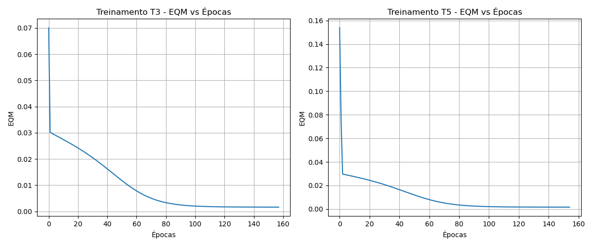

# Resolução da Atividade 1 - Perceptron Multicamadas

## 1. Treinamentos da Rede Perceptron

**Atividade:** *Execute 5 treinamentos para a rede PERCEPTRON inicializando as matrizes de pesos em cada treinamento com valores aleatórios entre 0 e 1... Registre os resultados finais desses 5 treinamentos.*

A rede foi treinada 5 vezes (denominadas T1 a T5), inicializando os pesos sinápticos aleatoriamente entre 0 e 1 em cada execução. Foi utilizada a função de ativação logística em todos os neurônios, taxa de aprendizado $\eta = 0.1$ e precisão de parada $\epsilon = 10^{-6}$.

**Tabela de Resultados dos Treinamentos:**

| Treinamento | Erro Quadrático Médio (EQM) | Número de Épocas |
| :--- | :--- | :--- |
| 1º (T1) | 0.001575 | 126 |
| 2º (T2) | 0.001590 | 137 |
| 3º (T3) | 0.001597 | 158 |
| 4º (T4) | 0.001574 | 148 |
| 5º (T5) | 0.001588 | 155 |

---

## 2. Gráficos de Erro Quadrático Médio (EQM)

**Atividade:** *Para os dois treinamentos com maiores números de épocas, trace os respectivos gráficos dos valores de erro quadrático médio (EQM) em função de cada época de treinamento.*

Os dois treinamentos que demandaram o maior número de épocas para atingir o critério de convergência foram o **T3 (158 épocas)** e o **T5 (155 épocas)**.

*(Os gráficos mostram uma queda acentuada do erro nas primeiras épocas, estabilizando-se assintoticamente até que a variação do erro entre épocas atinja a precisão exigida de $10^{-6}$).*

---

## 3. Variação de EQM e Épocas

**Atividade:** *Baseado na tabela, explique de forma detalhada por que tanto o erro quadrático médio quanto o número de épocas variam de treinamento para treinamento.*

**Resposta:**
Esta variação ocorre estritamente devido à **inicialização aleatória das matrizes de pesos sinápticos**. O algoritmo de *Backpropagation* (Regra Delta Generalizada) é um método de otimização baseado em gradiente descendente, cujo objetivo é encontrar o mínimo global (ou um mínimo local satisfatório) na superfície topológica do erro da rede neural.

Ao atribuir valores iniciais aleatórios e diferentes aos pesos em cada treinamento, a rede "inicia sua caminhada" a partir de um ponto coordenado diferente nessa superfície de erro multidimensional. Consequentemente:
1. **Variação de Épocas:** A distância e o caminho (inclinação do gradiente) que o algoritmo precisa percorrer até encontrar um vale que satisfaça a precisão ($\Delta EQM \leq 10^{-6}$) são diferentes a cada tentativa.
2. **Variação do EQM:** A rede frequentemente converge para diferentes mínimos locais na superfície de erro, resultando em valores finais de EQM distintos para cada inicialização.

---

## 4. Validação da Rede (Conjunto de Teste)

**Atividade:** *Faça a validação da rede aplicando o conjunto de teste fornecido... Forneça para cada treinamento o erro relativo médio (%) e a respectiva variância.*

A rede validou as amostras não vistas durante o treinamento. A tabela abaixo condensa os valores preditos $y_{rede}$ e as estatísticas comparativas em relação aos valores desejados $d$:

| Amostra | $d$ (desejado) | $y_{rede}$(T1) | $y_{rede}$(T2) | $y_{rede}$(T3) | $y_{rede}$(T4) | $y_{rede}$(T5) |
| :---: | :---: | :---: | :---: | :---: | :---: | :---: |
| 1 | 0.4831 | 0.4970 | 0.4961 | 0.4981 | 0.4933 | 0.4946 |
| 2 | 0.5965 | 0.6038 | 0.6021 | 0.6041 | 0.6025 | 0.6040 |
| 3 | 0.5318 | 0.5381 | 0.5380 | 0.5377 | 0.5349 | 0.5371 |
| 4 | 0.6843 | 0.7167 | 0.7169 | 0.7166 | 0.7176 | 0.7161 |
| 5 | 0.2872 | 0.2792 | 0.2841 | 0.2792 | 0.2861 | 0.2820 |
| 6 | 0.7663 | 0.7603 | 0.7627 | 0.7617 | 0.7616 | 0.7616 |
| 7 | 0.5666 | 0.5817 | 0.5813 | 0.5838 | 0.5787 | 0.5812 |
| 8 | 0.6601 | 0.6920 | 0.6918 | 0.6927 | 0.6905 | 0.6911 |
| 9 | 0.5427 | 0.5450 | 0.5423 | 0.5444 | 0.5420 | 0.5444 |
| 10 | 0.5836 | 0.6165 | 0.6164 | 0.6194 | 0.6128 | 0.6157 |
| 11 | 0.6950 | 0.7024 | 0.7026 | 0.7027 | 0.7023 | 0.7015 |
| 12 | 0.6790 | 0.6857 | 0.6854 | 0.6858 | 0.6858 | 0.6852 |
| 13 | 0.2956 | 0.2871 | 0.2939 | 0.2878 | 0.2925 | 0.2909 |
| 14 | 0.7742 | 0.7883 | 0.7888 | 0.7892 | 0.7902 | 0.7879 |
| 15 | 0.4662 | 0.4754 | 0.4744 | 0.4769 | 0.4727 | 0.4731 |
| 16 | 0.8093 | 0.8204 | 0.8238 | 0.8207 | 0.8241 | 0.8224 |
| 17 | 0.7581 | 0.7848 | 0.7865 | 0.7851 | 0.7889 | 0.7852 |
| 18 | 0.5826 | 0.6025 | 0.6021 | 0.6025 | 0.6012 | 0.6021 |
| 19 | 0.7938 | 0.8033 | 0.8049 | 0.8029 | 0.8057 | 0.8028 |
| 20 | 0.5012 | 0.5082 | 0.5067 | 0.5100 | 0.5048 | 0.5060 |
| **Erro Relativo Médio (%)** | | **2.3397** | **2.0904** | **2.4144** | **1.9645** | **2.1052** |
| **Variância (%)** | | **2.0920** | **2.4077** | **2.3258** | **2.2952** | **2.1101** |

---

## 5. Conclusão da Melhor Configuração

**Atividade:** *Indique qual das configurações finais de treinamento seria a mais adequada para o sistema de ressonância magnética, ou seja, qual delas está oferecendo a melhor generalização.*

**Resposta:**
A configuração mais adequada é a do **Treinamento 4 (T4)**. 

O principal objetivo do treinamento é fazer com que a rede generalize bem (evitando *overfitting* aos dados de treino). Analisando a tabela de validação, observa-se que o modelo T4 obteve o menor **Erro Relativo Médio (1.9645%)** sobre o conjunto de testes (dados cegos). Uma taxa menor de erro médio nas amostras não vistas comprova estatisticamente que a configuração T4 conseguiu "aprender" o comportamento subjacente da variável resposta $y$ da melhor forma, oferecendo assim o aproximador mais robusto e fidedigno para a operação do sistema de ressonância magnética no mundo real.

---
