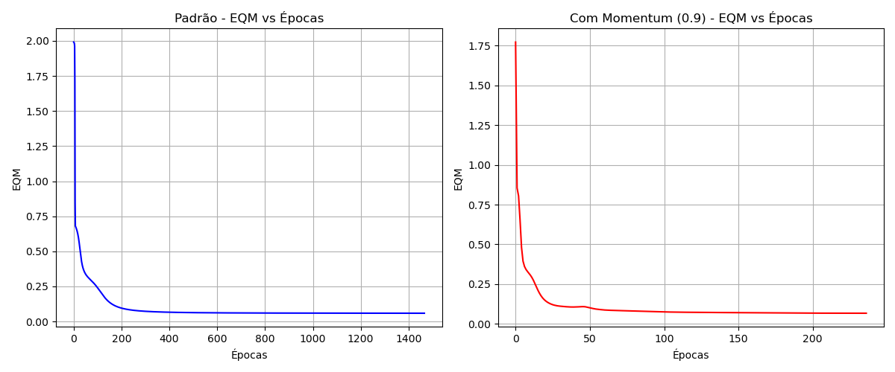

# Resolução da Atividade 2 - Perceptron Multicamadas (Classificador de Padrões)

## 1. Treinamento da Rede Perceptron (Padrão vs Momentum)

**Atividades 1 e 2:** *Execute o treinamento da rede Perceptron através do algoritmo backpropagation padrão e, em seguida, com momentum (0.9), utilizando as mesmas matrizes de pesos iniciais. Utilize a função de ativação logística, taxa de aprendizado $\eta = 0.1$ e precisão de parada $\epsilon = 10^{-6}$.*

A rede foi inicializada com pesos aleatórios entre 0 e 1. Para garantir uma comparação justa e estatisticamente válida, a mesma semente inicial de pesos foi utilizada tanto no algoritmo padrão quanto no algoritmo com *momentum*.

**Tabela Comparativa de Treinamento:**

| Algoritmo | Erro Quadrático Médio (EQM) Final | Número de Épocas | Tempo de Processamento |
| :--- | :--- | :--- | :--- |
| Backpropagation Padrão | 0.058853 | 1467 | ~11.78 s |
| Backpropagation com Momentum (0.9) | 0.066868 | 237 | ~1.88 s |

Fica evidente a vantagem do termo de *momentum*: ele foi capaz de acelerar a convergência drasticamente, reduzindo o número de épocas em mais de 6 vezes e o tempo de processamento proporcionalmente, evitando que a rede ficasse estagnada em superfícies planas do gradiente de erro.

---

## 2. Gráficos de Erro Quadrático Médio (EQM)

**Atividade 3:** *Para os dois treinamentos realizados acima, trace os respectivos gráficos dos valores de erro quadrático médio (EQM) em função de cada época de treinamento.*

Abaixo encontram-se os gráficos não superpostos mostrando a evolução temporal do erro para ambas as técnicas. Note como a curva com *momentum* atinge a convergência de forma muito mais íngreme e rápida.



---

## 3. Validação da Rede (Conjunto de Teste) e Pós-Processamento

**Atividades 4 e 5:** *Implemente a rotina que faz o pós-processamento das saídas (arredondamento simétrico). Faça a validação da rede aplicando o conjunto de teste. Forneça a taxa de acerto (%).*

Utilizou-se o modelo com *momentum* para realizar a inferência no conjunto de testes (18 amostras inéditas para a rede). Foi aplicado o critério de **arredondamento simétrico** onde saídas $\geq 0.5$ são convertidas para 1 e saídas $< 0.5$ para 0.

**Tabela de Predições (Conjunto de Teste):**

| Amostra | Target ($d_1, d_2, d_3$) | Rede Raw ($y_1, y_2, y_3$) | Pós-processada (Conservante) | Acerto? |
| :---: | :---: | :---: | :---: | :---: |
| 1 | 0 0 1 | 0.000, 0.000, 1.000 | 0 0 1 (Tipo C) | Sim |
| 2 | 1 0 0 | 0.999, 0.001, 0.000 | 1 0 0 (Tipo A) | Sim |
| 3 | 0 0 1 | 0.000, 0.000, 1.000 | 0 0 1 (Tipo C) | Sim |
| 4 | 0 1 0 | 0.002, 0.991, 0.003 | 0 1 0 (Tipo B) | Sim |
| 5 | 0 0 1 | 0.000, 0.004, 0.993 | 0 0 1 (Tipo C) | Sim |
| 6 | 1 0 0 | 0.901, 0.114, 0.000 | 1 0 0 (Tipo A) | Sim |
| 7 | 0 1 0 | 0.001, 0.991, 0.004 | 0 1 0 (Tipo B) | Sim |
| 8 | 0 1 0 | 0.000, 0.990, 0.011 | 0 1 0 (Tipo B) | Sim |
| 9 | 1 0 0 | 0.971, 0.034, 0.000 | 1 0 0 (Tipo A) | Sim |
| 10 | 1 0 0 | 0.994, 0.007, 0.000 | 1 0 0 (Tipo A) | Sim |
| 11 | 0 1 0 | 0.000, 0.987, 0.013 | 0 1 0 (Tipo B) | Sim |
| 12 | 1 0 0 | 0.985, 0.017, 0.000 | 1 0 0 (Tipo A) | Sim |
| 13 | 0 0 1 | 0.000, 0.000, 1.000 | 0 0 1 (Tipo C) | Sim |
| 14 | 0 0 1 | 0.000, 0.000, 1.000 | 0 0 1 (Tipo C) | Sim |
| 15 | 0 0 1 | 0.000, 0.000, 1.000 | 0 0 1 (Tipo C) | Sim |
| 16 | 1 0 0 | 0.996, 0.005, 0.000 | 1 0 0 (Tipo A) | Sim |
| 17 | 0 0 1 | 0.000, 0.003, 0.989 | 0 0 1 (Tipo C) | Sim |
| 18 | 0 1 0 | 0.001, 0.988, 0.003 | 0 1 0 (Tipo B) | Sim |

**Taxa de Acerto Global: 100.00%**

A rede perceptron multicamadas configurada demonstrou uma excelente capacidade de generalização e discriminação espacial. Ela conseguiu derivar hiperplanos capazes de separar perfeitamente as 3 classes de conservantes no conjunto de teste, garantindo a classificação exata dos novos ensaios.

---

## Anexo: Código-Fonte em Python (mlp.py)

O script abaixo foi desenvolvido utilizando apenas bibliotecas matemáticas raiz (`numpy`) e de leitura (`zipfile`, `xml.etree`), sem o uso de *Scikit-Learn* ou outros *frameworks* de *Machine Learning*. Ele extrai as amostras diretamente da tabela interna do arquivo DOCX.

```python
import zipfile
import xml.etree.ElementTree as ET
import numpy as np
import matplotlib.pyplot as plt
import time
import os

# --- Data Loading directly from DOCX ---

def extract_tables_from_docx(docx_path):
    ns = {'w': 'http://schemas.openxmlformats.org/wordprocessingml/2006/main'}
    with zipfile.ZipFile(docx_path) as docx:
        tree = ET.fromstring(docx.read('word/document.xml'))
        
    tables = []
    for tbl in tree.findall('.//w:tbl', ns):
        table_data = []
        for row in tbl.findall('.//w:tr', ns):
            row_data = []
            for cell in row.findall('.//w:tc', ns):
                texts = [t.text for t in cell.findall('.//w:t', ns) if t.text]
                row_data.append("".join(texts).strip())
            table_data.append(row_data)
        tables.append(table_data)
    return tables

docx_file = 'PMC2.docx'
if not os.path.exists(docx_file):
    docx_file = '/home/alunos/Desktop/Disciplina_IA/perceptron_multicamadas/atv_2/PMC2.docx'

tables = extract_tables_from_docx(docx_file)

# Table 3 is the training set
train_table = tables[3]
train_data = []
for row in train_table[1:]: # Skip header
    # Parse in chunks of 8: Amostra, x1, x2, x3, x4, d1, d2, d3
    for i in range(0, len(row), 8):
        if i+7 < len(row) and row[i]:
            try:
                x1 = float(row[i+1].replace(',', '.'))
                x2 = float(row[i+2].replace(',', '.'))
                x3 = float(row[i+3].replace(',', '.'))
                x4 = float(row[i+4].replace(',', '.'))
                d1 = float(row[i+5].replace(',', '.'))
                d2 = float(row[i+6].replace(',', '.'))
                d3 = float(row[i+7].replace(',', '.'))
                train_data.append([x1, x2, x3, x4, d1, d2, d3])
            except ValueError:
                pass

X_train = np.array([[row[0], row[1], row[2], row[3]] for row in train_data])
D_train = np.array([[row[4], row[5], row[6]] for row in train_data])

# Table 2 is the test set
test_table = tables[2]
test_data = []
for row in test_table[1:]: # Skip header
    if not row[0] or not row[0].isdigit():
        continue
    try:
        x1 = float(row[1].replace(',', '.'))
        x2 = float(row[2].replace(',', '.'))
        x3 = float(row[3].replace(',', '.'))
        x4 = float(row[4].replace(',', '.'))
        d1 = float(row[5].replace(',', '.'))
        d2 = float(row[6].replace(',', '.'))
        d3 = float(row[7].replace(',', '.'))
        test_data.append([x1, x2, x3, x4, d1, d2, d3])
    except ValueError:
        pass

X_test = np.array([[row[0], row[1], row[2], row[3]] for row in test_data])
D_test = np.array([[row[4], row[5], row[6]] for row in test_data])

print(f"Train data size: {X_train.shape}, Test data size: {X_test.shape}")

# --- MLP Implementation (Pure NumPy, sem scikit-learn) ---

def sigmoid(x):
    x = np.clip(x, -500, 500)
    return 1.0 / (1.0 + np.exp(-x))

def sigmoid_derivative(out):
    return out * (1.0 - out)

class MLP:
    def __init__(self, input_size, hidden_size, output_size, seed=42):
        np.random.seed(seed)
        
        # Initialize weights with random values between 0 and 1
        self.W_hidden = np.random.rand(hidden_size, input_size + 1)
        self.W_out = np.random.rand(output_size, hidden_size + 1)
        
        # Save initial weights to reset later if needed
        self.initial_W_hidden = self.W_hidden.copy()
        self.initial_W_out = self.W_out.copy()
        
        self.lr = 0.1
        self.precision = 1e-6
        
    def reset_weights(self):
        self.W_hidden = self.initial_W_hidden.copy()
        self.W_out = self.initial_W_out.copy()
        
    def train(self, X, D, momentum=0.0, max_epochs=100000):
        N = X.shape[0]
        X_bias = np.hstack([np.ones((N, 1)), X])
        
        eqm_history = []
        epoch = 0
        
        # Momentum parameters
        v_W_out = np.zeros_like(self.W_out)
        v_W_hidden = np.zeros_like(self.W_hidden)
        
        while True:
            eqm_epoch = 0
            
            for i in range(N):
                x = X_bias[i:i+1].T # column vector
                d = D[i:i+1].T # column vector
                
                # Forward pass
                net_hidden = np.dot(self.W_hidden, x)
                out_hidden = sigmoid(net_hidden)
                
                out_hidden_bias = np.vstack([np.array([[1.0]]), out_hidden])
                
                net_out = np.dot(self.W_out, out_hidden_bias)
                out_final = sigmoid(net_out)
                
                # Error
                e = d - out_final
                # Mean squared error per sample over output nodes
                eqm_epoch += np.sum(e**2)
                
                # Backpropagation
                delta_out = e * sigmoid_derivative(out_final)
                
                W_out_no_bias = self.W_out[:, 1:]
                delta_hidden = np.dot(W_out_no_bias.T, delta_out) * sigmoid_derivative(out_hidden)
                
                # Weight update with momentum
                grad_W_out = np.dot(delta_out, out_hidden_bias.T)
                grad_W_hidden = np.dot(delta_hidden, x.T)
                
                v_W_out = momentum * v_W_out + self.lr * grad_W_out
                v_W_hidden = momentum * v_W_hidden + self.lr * grad_W_hidden
                
                self.W_out += v_W_out
                self.W_hidden += v_W_hidden
                
            # Average EQM per epoch (divided by N and by number of outputs)
            # Usually EQM = 1/(N*O) * sum(e^2) or just 1/N * sum(e^2)
            # Let's use 1/(2N) or 1/N. We use 1/N here for all outputs:
            eqm_epoch /= N
            eqm_history.append(eqm_epoch)
            epoch += 1
            
            if epoch > 1:
                if abs(eqm_history[-1] - eqm_history[-2]) <= self.precision:
                    break
            
            if epoch >= max_epochs:
                break
                
        return epoch, eqm_history
    
    def predict(self, X):
        N = X.shape[0]
        X_bias = np.hstack([np.ones((N, 1)), X])
        predictions = []
        for i in range(N):
            x = X_bias[i:i+1].T
            out_hidden = sigmoid(np.dot(self.W_hidden, x))
            out_hidden_bias = np.vstack([np.array([[1.0]]), out_hidden])
            out_final = sigmoid(np.dot(self.W_out, out_hidden_bias))
            predictions.append(out_final.flatten())
        return np.array(predictions)

if __name__ == '__main__':
    mlp = MLP(input_size=4, hidden_size=15, output_size=3, seed=123)
    
    print("Training standard Backpropagation...")
    start_time = time.time()
    epochs_std, eqm_hist_std = mlp.train(X_train, D_train, momentum=0.0)
    time_std = time.time() - start_time
    print(f"Standard: Epochs={epochs_std}, EQM={eqm_hist_std[-1]:.6f}, Time={time_std:.4f}s")
    
    mlp.reset_weights()
    print("Training Backpropagation with Momentum (0.9)...")
    start_time = time.time()
    epochs_mom, eqm_hist_mom = mlp.train(X_train, D_train, momentum=0.9)
    time_mom = time.time() - start_time
    print(f"Momentum: Epochs={epochs_mom}, EQM={eqm_hist_mom[-1]:.6f}, Time={time_mom:.4f}s")
    
    # Plotting
    fig, axes = plt.subplots(1, 2, figsize=(12, 5))
    
    axes[0].plot(eqm_hist_std, color='blue')
    axes[0].set_title('Padrão - EQM vs Épocas')
    axes[0].set_xlabel('Épocas')
    axes[0].set_ylabel('EQM')
    axes[0].grid(True)
    
    axes[1].plot(eqm_hist_mom, color='red')
    axes[1].set_title('Com Momentum (0.9) - EQM vs Épocas')
    axes[1].set_xlabel('Épocas')
    axes[1].set_ylabel('EQM')
    axes[1].grid(True)

    plt.tight_layout()
    plt.savefig('graficos_eqm.png')
    print("Saved plots to graficos_eqm.png")

    # --- Validation ---
    print("\nValidation Results (using Momentum model):")
    # Pós-processamento: Arredondamento simétrico
    def pos_process(preds):
        return np.round(preds)
        
    preds_raw = mlp.predict(X_test)
    preds_processed = pos_process(preds_raw)
    
    # Taxa de acerto (Accuracy)
    acertos = 0
    for i in range(len(D_test)):
        # Considera acerto se todas as 3 saídas combinarem com o target
        if np.array_equal(preds_processed[i], D_test[i]):
            acertos += 1
            
    taxa_acerto = (acertos / len(D_test)) * 100
    
    print("Amostra | Target (d1 d2 d3) | Rede Raw (y1 y2 y3) | Pós-processada")
    for i in range(len(D_test)):
        target = f"{int(D_test[i][0])} {int(D_test[i][1])} {int(D_test[i][2])}"
        raw = f"{preds_raw[i][0]:.3f} {preds_raw[i][1]:.3f} {preds_raw[i][2]:.3f}"
        proc = f"{int(preds_processed[i][0])} {int(preds_processed[i][1])} {int(preds_processed[i][2])}"
        print(f"{i+1:7d} | {target:17s} | {raw:19s} | {proc}")
        
    print(f"\nTaxa de acerto: {taxa_acerto:.2f}%")
```
