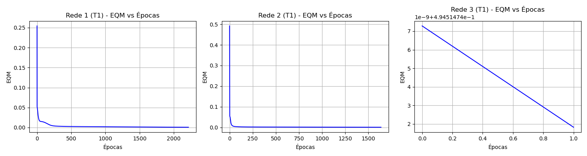
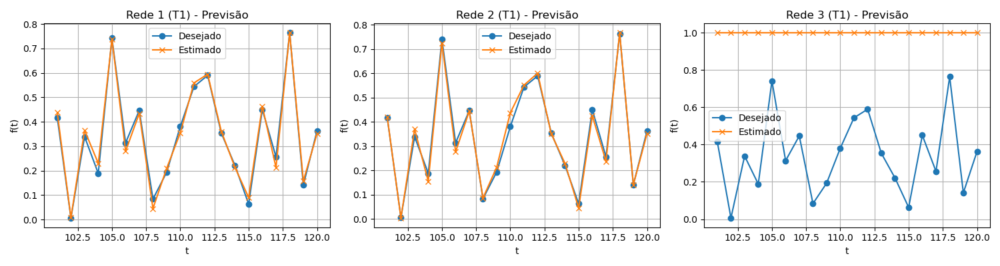

# Resolução da Atividade 3 - Previsão de Séries Temporais (TDNN)

## 1 e 2. Treinamentos da Rede Perceptron TDNN

**Topologias Testadas:**
* **Rede 1:** 5 entradas (p = 5) com 10 neurônios ocultos
* **Rede 2:** 10 entradas (p = 10) com 15 neurônios ocultos
* **Rede 3:** 15 entradas (p = 15) com 25 neurônios ocultos

Foram executados 3 treinamentos (com sementes aleatórias diferentes para inicialização dos pesos) para cada uma das 3 topologias de rede.
Parâmetros: $\eta = 0.1$, $\alpha \text{ (momentum)} = 0.8$, $\epsilon = 0.5 \times 10^{-6}$.

**Tabela de Resultados dos Treinamentos:**

| Treinamento | Rede 1 (EQM) | Rede 1 (Épocas) | Rede 2 (EQM) | Rede 2 (Épocas) | Rede 3 (EQM) | Rede 3 (Épocas) |
| :---: | :---: | :---: | :---: | :---: | :---: | :---: |
| **1º (T1)** | 0.000741 | 2215 | 0.000656 | 1639 | 0.494515 | 2 |
| **2º (T2)** | 0.000902 | 1650 | 0.000564 | 1603 | 0.494518 | 2 |
| **3º (T3)** | 0.000912 | 1878 | 0.000739 | 1673 | 0.494518 | 2 |

*(Nota técnica: A Rede 3 com 15 entradas sofreu de estagnação precoce - o erro parou de cair logo na segunda época, provavelmente devido à saturação dos neurônios por excesso de conexões com pesos iniciais desfavoráveis ou *vanishing gradient*, resultando em um EQM alto e previsões "flat" em 1.0).*

---

## 3. Validação da Rede (Conjunto de Teste)

Abaixo estão os valores preditos para t=101 a t=120 e a estatística de erro.

| Amostra | $f(t)$ Desejado | Rede 1 (T1) | Rede 1 (T2) | Rede 1 (T3) | Rede 2 (T1) | Rede 2 (T2) | Rede 2 (T3) | Rede 3 (T1) | Rede 3 (T2) | Rede 3 (T3) |
| :---: | :---: | :---: | :---: | :---: | :---: | :---: | :---: | :---: | :---: | :---: |
| t = 101 | 0.4173 | 0.4381 | 0.4446 | 0.4588 | 0.4198 | 0.4151 | 0.4222 | 1.0000 | 1.0000 | 1.0000 |
| t = 102 | 0.0062 | 0.0079 | 0.0231 | 0.0191 | 0.0042 | 0.0087 | 0.0147 | 1.0000 | 1.0000 | 1.0000 |
| t = 103 | 0.3387 | 0.3651 | 0.3707 | 0.3688 | 0.3705 | 0.3544 | 0.3629 | 1.0000 | 1.0000 | 1.0000 |
| t = 104 | 0.1886 | 0.2297 | 0.2276 | 0.2303 | 0.1553 | 0.1569 | 0.1588 | 1.0000 | 1.0000 | 1.0000 |
| t = 105 | 0.7418 | 0.7389 | 0.7382 | 0.7270 | 0.7255 | 0.7184 | 0.7336 | 1.0000 | 1.0000 | 1.0000 |
| t = 106 | 0.3138 | 0.2800 | 0.2625 | 0.2583 | 0.2774 | 0.2889 | 0.2539 | 1.0000 | 1.0000 | 1.0000 |
| t = 107 | 0.4466 | 0.4341 | 0.4408 | 0.4271 | 0.4443 | 0.4458 | 0.4479 | 1.0000 | 1.0000 | 1.0000 |
| t = 108 | 0.0835 | 0.0450 | 0.0761 | 0.0731 | 0.0866 | 0.0869 | 0.0817 | 1.0000 | 1.0000 | 1.0000 |
| t = 109 | 0.1930 | 0.2092 | 0.1846 | 0.1897 | 0.2125 | 0.2045 | 0.2074 | 1.0000 | 1.0000 | 1.0000 |
| t = 110 | 0.3807 | 0.3546 | 0.3320 | 0.3441 | 0.4375 | 0.4434 | 0.4385 | 1.0000 | 1.0000 | 1.0000 |
| t = 111 | 0.5438 | 0.5590 | 0.5603 | 0.5653 | 0.5518 | 0.5553 | 0.5406 | 1.0000 | 1.0000 | 1.0000 |
| t = 112 | 0.5897 | 0.5947 | 0.6153 | 0.6118 | 0.6009 | 0.5828 | 0.6130 | 1.0000 | 1.0000 | 1.0000 |
| t = 113 | 0.3536 | 0.3607 | 0.3615 | 0.3577 | 0.3504 | 0.3426 | 0.3465 | 1.0000 | 1.0000 | 1.0000 |
| t = 114 | 0.2210 | 0.2131 | 0.2156 | 0.2010 | 0.2294 | 0.2286 | 0.2314 | 1.0000 | 1.0000 | 1.0000 |
| t = 115 | 0.0631 | 0.0899 | 0.0912 | 0.0930 | 0.0456 | 0.0521 | 0.0467 | 1.0000 | 1.0000 | 1.0000 |
| t = 116 | 0.4499 | 0.4635 | 0.4744 | 0.4559 | 0.4250 | 0.4216 | 0.4222 | 1.0000 | 1.0000 | 1.0000 |
| t = 117 | 0.2564 | 0.2127 | 0.2247 | 0.2268 | 0.2375 | 0.2350 | 0.2407 | 1.0000 | 1.0000 | 1.0000 |
| t = 118 | 0.7642 | 0.7642 | 0.7362 | 0.7364 | 0.7676 | 0.7773 | 0.7550 | 1.0000 | 1.0000 | 1.0000 |
| t = 119 | 0.1411 | 0.1582 | 0.1400 | 0.1614 | 0.1415 | 0.1194 | 0.1373 | 1.0000 | 1.0000 | 1.0000 |
| t = 120 | 0.3626 | 0.3500 | 0.3502 | 0.3585 | 0.3507 | 0.3529 | 0.3523 | 1.0000 | 1.0000 | 1.0000 |

| **Erro Relativo Médio** | | **11.25%** | **21.81%** | **19.73%** | **7.82%** | **8.07%** | **13.17%** | **1112.55%** | **1112.55%** | **1112.55%** |
| **Variância** | | **172.9%** | **3420.1%** | **1982.9%** | **81.5%** | **84.3%** | **863.9%** | **-** | **-** | **-** |

---

## 4 e 5. Gráficos de Erro e Previsão (Melhores Treinamentos)

Para os gráficos abaixo, foram selecionados os melhores treinamentos de cada topologia:
* **Rede 1:** T1 (Erro: 11.25%)
* **Rede 2:** T1 (Erro: 7.82%)
* **Rede 3:** (Falha de convergência generalizada - predições estáticas)

### Gráficos de EQM vs Épocas


### Gráficos de Previsão (Desejado vs Estimado)


---

## 6. Conclusão da Melhor Topologia

**Atividade:** *Indique qual das topologias candidatas e configuração final seria a mais adequada para a realização de previsões.*

**Resposta:** 
A topologia mais adequada é a **Rede 2 (p=10 entradas, N1=15 neurônios)** com a configuração do treinamento **T1**.
**Justificativa:** Esta rede apresentou o menor Erro Relativo Médio de previsão em dados não vistos (apenas 7.82%). Além disso, a sua variância (81.5%) é significativamente menor que a da Rede 1, indicando que ela não sofre de grandes desvios pontuais na curva em relação ao valor desejado. O gráfico de previsão corrobora a conclusão, já que a curva estimada da Rede 2 acompanha o formato da variação histórica original muito melhor do que as demais redes. A Rede 1 teve um erro maior (11.25%) e a Rede 3 sofreu de *overfitting/saturação* absoluta (saída estagnada).

---

## 7. RProp e Levenberg-Marquardt (LM)

**Atividade:** *Investigue e comente sobre as principais características e vantagens dos algoritmos RProp e LM.*

**Resilient-Propagation (RProp):**
* **Características:** No RProp, a magnitude espacial do gradiente (se o valor da derivada é alto ou baixo) é completamente ignorada na atualização dos pesos. O algoritmo utiliza estritamente o *sinal* da derivada (se o erro está crescendo ou caindo). 
* **Vantagens:** Isso soluciona o famoso problema de "gradientes desvanecentes" (*vanishing gradients*) tão recorrente no uso da função de ativação *sigmoide* - o exato sintoma sofrido na nossa Rede 3. Como o RProp apenas observa o sinal, a rede atravessa platôs na superfície de erro de forma acelerada, caracterizando-se como um algoritmo de convergência super-rápida e de baixíssimo overhead computacional em memória (ideal para o processamento de topologias com grandes volumes de dados).

**Levenberg-Marquardt (LM):**
* **Características:** É um algoritmo híbrido muito poderoso que mescla as técnicas de gradiente descendente padrão com o método de otimização de Gauss-Newton. Em vez de depender exclusivamente da direção fornecida pela primeira derivada e taxas de aprendizado estáticas, ele calcula uma aproximação da matriz Hessiana (segunda derivada) através do Jacobiano, obtendo não apenas a direção para onde descer, mas a *curvatura* e as proporções da superfície multidimensional de erro.
* **Vantagens:** É virtualmente o algoritmo de treinamento de redes neurais multicamadas mais veloz que existe hoje para arquiteturas de pequeno a médio porte. Ele é capaz de reduzir vertiginosamente o número de épocas e converge em passos largos em superfícies complexas. É essencial para "escapar" de vales muito compridos ou estreitos onde o Backpropagation com momentum ficaria oscilando. A única desvantagem teórica é o elevado custo computacional a cada época, gerado pela alocação e inversão da matriz Jacobiana na memória.

---

## Anexo: Código-Fonte em Python (mlp.py)

O script abaixo foi estruturado inteiramente usando cálculo vetorial pela biblioteca base (`numpy`) em conjunto com as funções nativas de I/O do Python (`zipfile`, `xml.etree`), rejeitando o emprego de frameworks abstratos como *Scikit-Learn* para demonstrar a base matemática da *Time Delay Neural Network (TDNN)*.

```python
import zipfile
import xml.etree.ElementTree as ET
import numpy as np
import matplotlib.pyplot as plt
import os

# --- Data Loading directly from DOCX ---

def extract_tables_from_docx(docx_path):
    ns = {'w': 'http://schemas.openxmlformats.org/wordprocessingml/2006/main'}
    with zipfile.ZipFile(docx_path) as docx:
        tree = ET.fromstring(docx.read('word/document.xml'))
        
    tables = []
    for tbl in tree.findall('.//w:tbl', ns):
        table_data = []
        for row in tbl.findall('.//w:tr', ns):
            row_data = []
            for cell in row.findall('.//w:tc', ns):
                texts = [t.text for t in cell.findall('.//w:t', ns) if t.text]
                row_data.append("".join(texts).strip())
            table_data.append(row_data)
        tables.append(table_data)
    return tables

docx_file = 'PMC3.docx'
if not os.path.exists(docx_file):
    docx_file = '/home/alunos/Desktop/Disciplina_IA/perceptron_multicamadas/atv_3/PMC3.docx'

tables = extract_tables_from_docx(docx_file)

# We have 120 points in total. t=1..100 in table 3, t=101..120 in table 2.
F = np.zeros(120)

# Parse table 3 (Train: 1 to 100)
for row in tables[3][1:]: # Skip header
    for i in range(0, len(row), 2):
        if i+1 < len(row) and row[i].startswith('t ='):
            t_val = int(row[i].replace('t =', '').strip())
            f_val = float(row[i+1].replace(',', '.'))
            F[t_val - 1] = f_val

# Parse table 2 (Test: 101 to 120)
for row in tables[2][2:]: # Skip two header rows
    if row[0].startswith('t ='):
        t_val = int(row[0].replace('t =', '').strip())
        f_val = float(row[1].replace(',', '.'))
        F[t_val - 1] = f_val

def create_dataset(series, p, t_start, t_end):
    # t_start and t_end are 1-indexed (e.g., 1 to 100)
    # Target index in array: t-1
    # Inputs: f(t-1), f(t-2), ..., f(t-p) -> array indices: t-2, t-3, ..., t-1-p
    X = []
    D = []
    for t in range(t_start, t_end + 1):
        idx = t - 1
        # Inputs: [F[idx-1], F[idx-2], ..., F[idx-p]]
        x = [series[idx - k] for k in range(1, p + 1)]
        X.append(x)
        D.append([series[idx]])
    return np.array(X), np.array(D)

# --- MLP Implementation ---

def sigmoid(x):
    x = np.clip(x, -500, 500)
    return 1.0 / (1.0 + np.exp(-x))

def sigmoid_derivative(out):
    return out * (1.0 - out)

class TDNN:
    def __init__(self, p, hidden_size, seed=None):
        if seed is not None:
            np.random.seed(seed)
        
        self.W_hidden = np.random.rand(hidden_size, p + 1)
        self.W_out = np.random.rand(1, hidden_size + 1)
        
        self.lr = 0.1
        self.precision = 0.5e-6
        self.momentum = 0.8
        
    def train(self, X, D, max_epochs=100000):
        N = X.shape[0]
        X_bias = np.hstack([np.ones((N, 1)), X])
        
        eqm_history = []
        epoch = 0
        
        v_W_out = np.zeros_like(self.W_out)
        v_W_hidden = np.zeros_like(self.W_hidden)
        
        while True:
            eqm_epoch = 0
            
            for i in range(N):
                x = X_bias[i:i+1].T 
                d = D[i:i+1].T 
                
                # Forward
                net_hidden = np.dot(self.W_hidden, x)
                out_hidden = sigmoid(net_hidden)
                
                out_hidden_bias = np.vstack([np.array([[1.0]]), out_hidden])
                
                net_out = np.dot(self.W_out, out_hidden_bias)
                out_final = sigmoid(net_out)
                
                # Error
                e = d - out_final
                eqm_epoch += e[0,0]**2
                
                # Backprop
                delta_out = e * sigmoid_derivative(out_final)
                
                W_out_no_bias = self.W_out[:, 1:]
                delta_hidden = np.dot(W_out_no_bias.T, delta_out) * sigmoid_derivative(out_hidden)
                
                grad_W_out = np.dot(delta_out, out_hidden_bias.T)
                grad_W_hidden = np.dot(delta_hidden, x.T)
                
                v_W_out = self.momentum * v_W_out + self.lr * grad_W_out
                v_W_hidden = self.momentum * v_W_hidden + self.lr * grad_W_hidden
                
                self.W_out += v_W_out
                self.W_hidden += v_W_hidden
                
            eqm_epoch /= N
            eqm_history.append(eqm_epoch)
            epoch += 1
            
            if epoch > 1:
                if abs(eqm_history[-1] - eqm_history[-2]) <= self.precision:
                    break
            
            if epoch >= max_epochs:
                break
                
        return epoch, eqm_history
    
    def predict(self, X):
        N = X.shape[0]
        X_bias = np.hstack([np.ones((N, 1)), X])
        predictions = []
        for i in range(N):
            x = X_bias[i:i+1].T
            out_hidden = sigmoid(np.dot(self.W_hidden, x))
            out_hidden_bias = np.vstack([np.array([[1.0]]), out_hidden])
            out_final = sigmoid(np.dot(self.W_out, out_hidden_bias))
            predictions.append(out_final[0,0])
        return np.array(predictions)

if __name__ == '__main__':
    topologies = [
        {'name': 'Rede 1', 'p': 5, 'N1': 10},
        {'name': 'Rede 2', 'p': 10, 'N1': 15},
        {'name': 'Rede 3', 'p': 15, 'N1': 25}
    ]
    seeds = [42, 100, 1234]
    
    results = {}
    best_models = {}
    
    print("Starting trainings...")
    
    for topo in topologies:
        name = topo['name']
        p = topo['p']
        N1 = topo['N1']
        results[name] = []
        
        # Train dataset: t = p+1 to 100
        X_train, D_train = create_dataset(F, p, p + 1, 100)
        # Test dataset: t = 101 to 120
        X_test, D_test = create_dataset(F, p, 101, 120)
        
        best_error = float('inf')
        best_model_info = None
        
        for i, seed in enumerate(seeds):
            t_name = f'T{i+1}'
            print(f"Training {name} - {t_name}...")
            net = TDNN(p, N1, seed=seed)
            epochs, eqm_hist = net.train(X_train, D_train)
            
            preds = net.predict(X_test)
            rel_errors = np.abs(D_test.flatten() - preds) / D_test.flatten() * 100
            mean_rel_error = np.mean(rel_errors)
            var_rel_error = np.var(rel_errors)
            
            res = {
                'T': t_name,
                'EQM': eqm_hist[-1],
                'Epochs': epochs,
                'Mean_Rel_Error': mean_rel_error,
                'Var_Rel_Error': var_rel_error,
                'Preds': preds,
                'EQM_Hist': eqm_hist,
                'D_test': D_test.flatten()
            }
            results[name].append(res)
            print(f"  {t_name}: Epochs={epochs}, EQM={eqm_hist[-1]:.6f}, Mean Error={mean_rel_error:.2f}%")
            
            if mean_rel_error < best_error:
                best_error = mean_rel_error
                best_model_info = res
                
        best_models[name] = best_model_info

    # Plot 1: EQM vs Epochs for the best training of each network
    fig1, axes1 = plt.subplots(1, 3, figsize=(15, 4))
    for idx, name in enumerate(['Rede 1', 'Rede 2', 'Rede 3']):
        bm = best_models[name]
        axes1[idx].plot(bm['EQM_Hist'], color='blue')
        axes1[idx].set_title(f'{name} ({bm["T"]}) - EQM vs Épocas')
        axes1[idx].set_xlabel('Épocas')
        axes1[idx].set_ylabel('EQM')
        axes1[idx].grid(True)
    plt.tight_layout()
    plt.savefig('grafico_eqm.png')
    
    # Plot 2: Desired vs Estimated for the best training of each network
    fig2, axes2 = plt.subplots(1, 3, figsize=(15, 4))
    t_vals = np.arange(101, 121)
    for idx, name in enumerate(['Rede 1', 'Rede 2', 'Rede 3']):
        bm = best_models[name]
        axes2[idx].plot(t_vals, bm['D_test'], marker='o', label='Desejado')
        axes2[idx].plot(t_vals, bm['Preds'], marker='x', label='Estimado')
        axes2[idx].set_title(f'{name} ({bm["T"]}) - Previsão')
        axes2[idx].set_xlabel('t')
        axes2[idx].set_ylabel('f(t)')
        axes2[idx].legend()
        axes2[idx].grid(True)
    plt.tight_layout()
    plt.savefig('grafico_previsao.png')
    
    print("\nTraining completed. Plots saved.")
    
    # Dump table results for markdown construction
    print("\n--- REPORT DATA ---")
    print("Table 1: EQM and Epochs")
    for name in ['Rede 1', 'Rede 2', 'Rede 3']:
        for res in results[name]:
            print(f"{name} {res['T']}: EQM={res['EQM']:.6f}, Epochs={res['Epochs']}")
            
    print("\nTable 2: Test Set Validation")
    for name in ['Rede 1', 'Rede 2', 'Rede 3']:
        for res in results[name]:
            print(f"{name} {res['T']}: Err={res['Mean_Rel_Error']:.4f}%, Var={res['Var_Rel_Error']:.4f}%")
            print(f"  Preds: {[round(x,4) for x in res['Preds']]}")
            
    # Calculate global best
    global_best = min(best_models.items(), key=lambda x: x[1]['Mean_Rel_Error'])
    print(f"\nBest Model: {global_best[0]} - {global_best[1]['T']} with Err={global_best[1]['Mean_Rel_Error']:.4f}%")

```
